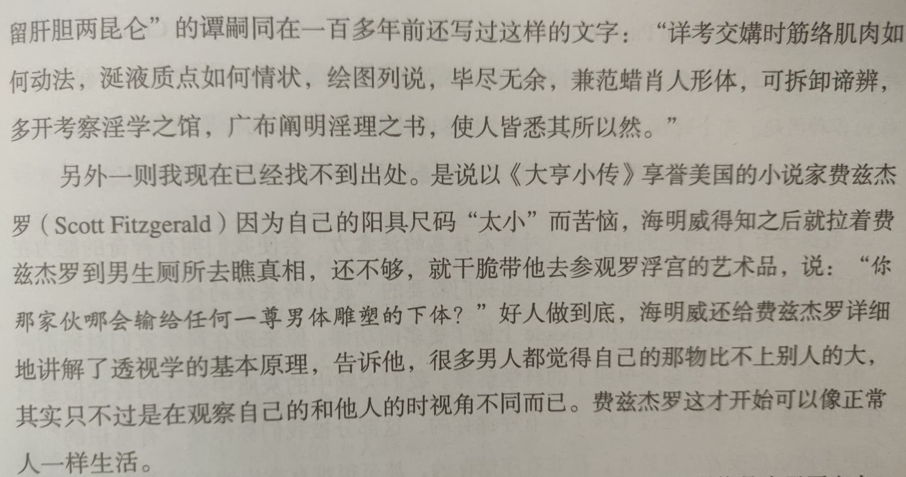

# 生命在于心脏运动🏃

<audio controls autoplay>
  <source src="../audio/Ear.m4a" type="audio/mp4">
Your browser does not support the audio element.
</audio>

从明天起，做一个Xìng福的人。

早睡，早起，环游操场。

直接原因：没有自信去办健身房VIP卡；

根本原因：体能锻炼有利于男人[性](https://lixiaolai.com/#/ji/)能力的维持。

在初中的英语课本上有一个关于对生命中重要的存在的优先级排序开放性讨论：当时我的老师让我回答哪一个最重要——我说在我心目中健康是排在第一位的，TA很赞同。

如今亲人因[病](https://book.douban.com/subject/26576861/)去世，我再次回想到这个小片段——当我们身体良好时因其他事烦恼，当一次小感冒却头痛鼻塞流涕难熬。所以在发呆的契机中，我不禁陷入[哲学](https://book.douban.com/subject/25961458/)思考——究竟人这一生中弥足珍贵的到底是什么？

拼了命地赚钱去还房贷？这点因为中国的土地制度，政府收取了土地价值。

底层人只能用易被替换的、没技术含量的技能谋生，中产阶级被更高级的收入陷阱迷惑，我一个normal无法逃脱这种宿命。

我只愿面朝大海，春暖花开～

Last updated on December 8th at 10:47 p.m. (GMT +8)

[back](../../)
